# Tax Investigation System — Complete Documentation

## Table of Contents
1. [Project Overview](#1-project-overview)
2. [System Architecture](#2-system-architecture)
3. [Pipeline Flow — End to End](#3-pipeline-flow--end-to-end)
4. [Module-by-Module Deep Dive](#4-module-by-module-deep-dive)
5. [Data Models](#5-data-models)
6. [Configuration System](#6-configuration-system)
7. [Centralized Prompt Management](#7-centralized-prompt-management)
8. [LLM Integration](#8-llm-integration)
9. [Discrepancy Engine](#9-discrepancy-engine)
10. [Decision Logic](#10-decision-logic)
11. [Document Generation](#11-document-generation)
12. [Output Packaging](#12-output-packaging)
13. [Testing Suite](#13-testing-suite)
14. [Utility Scripts](#14-utility-scripts)
15. [Input Data Structure](#15-input-data-structure)
16. [Supported File Formats](#16-supported-file-formats)
17. [Error Handling & Fallbacks](#17-error-handling--fallbacks)
18. [Usage Guide](#18-usage-guide)

---

## 1. Project Overview

**Purpose:** An LLM-powered tax compliance analysis system that automates the discovery, extraction, reconciliation, and forensic review of discrepancies between Indian tax documents (Form 16, AIS, ITR Extract).

**Key Capabilities:**
- Case discovery (single or batch mode from `input/` directory)
- Multi-sheet XLSX and DOCX document extraction with graceful fallbacks
- Multi-strategy taxpayer identity resolution (PAN, Name, Assessment Year)
- Deterministic discrepancy analysis with Indian Income Tax thresholds
- LLM-powered forensic review (OpenRouter/vLLM/Ollama) with deterministic fallback
- Cross-validation of LLM decisions against statutory thresholds
- DOCX report/notice generation from Jinja2 templates
- PDF conversion (3-tier fallback: LibreOffice → docx2pdf → fpdf2)
- Full JSON audit trail with provenance tracking

**Tech Stack:**
| Component | Library |
|-----------|---------|
| Core language | Python 3.11+ |
| Data models | Pydantic v2 |
| Data processing | Pandas, NumPy |
| Excel handling | openpyxl, xlrd |
| Document processing | python-docx, docxtpl (Jinja2) |
| LLM client | langchain-openai (ChatOpenAI), langchain-ollama (ChatOllama) |
| LLM messages | langchain-core (SystemMessage, HumanMessage) |
| PDF generation | fpdf2 (pure Python) |
| Document AI (optional) | docling |
| Environment | python-dotenv |
| Testing | Built-in (subprocess-based E2E) |

---

## 2. System Architecture

### Directory Layout

```
cohert_project/
├── main.py                          # Orchestrator / CLI entry point
├── src/
│   ├── __init__.py                  # Package marker
│   ├── config.py                    # Paths, LLM settings, template auto-detection
│   ├── utils.py                     # SHA-256, ISO timestamps, Decimal parsing, graceful imports
│   ├── models.py                    # Pydantic data models (TaxpayerIdentity, Form16Data, AISData, ITRData, CanonicalTaxCase)
│   ├── prompts.py                   # ⭐ Centralized prompt registry (single source of truth)
│   ├── parsing.py                   # Regex patterns + text/table identity extraction
│   ├── case_discovery.py            # CaseManifest dataclass + discover_cases()
│   ├── extraction.py                # Document extraction (DOCX/XLSX/fallback)
│   ├── mapping.py                   # Raw extraction → canonical Pydantic models
│   ├── validation.py                # Data quality checks (PAN, AY, negative amounts)
│   ├── discrepancies.py             # Rule-based comparison engine
│   ├── llm_reviewer.py              # LLM forensic analysis (prompts from prompts.py)
│   ├── decision.py                  # Decision composer (notice/report/no-action)
│   ├── document_gen.py              # DOCX template rendering + PDF conversion
│   └── output.py                    # JSON output packaging (6 files per case)
├── tests/
│   ├── test_imports.py              # Module import verification
│   ├── test_e2e.py                  # Full end-to-end pipeline test
│   └── create_fixtures.py           # Test fixture generator
├── input/                           # Case files (27 Record folders × 3 XLSX each)
├── sample/                          # DOCX templates (REPORT_TEMPLATE.docx, notice.docx)
├── output/                          # Generated outputs (auto-created)
├── requirements.txt
├── run.sh / run.bat                 # Launcher scripts
└── *.py                             # Utility scripts (create_compliant_records, etc.)
```

### Prompt Management Layer

```
src/prompts.py              ← ALL prompts (single source of truth)
        ↓
src/llm_reviewer.py         ← orchestration only (no hardcoded prompt text)
        ↓
LangChain (ChatOpenAI / ChatOllama)
        ↓
OpenRouter / vLLM / Ollama  ← LLM provider
```

### Module Dependency Graph

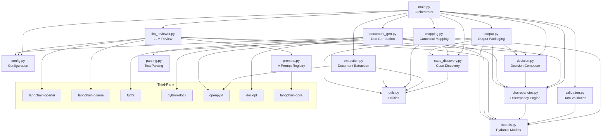

---

## 3. Pipeline Flow — End to End

### Complete Data Flow

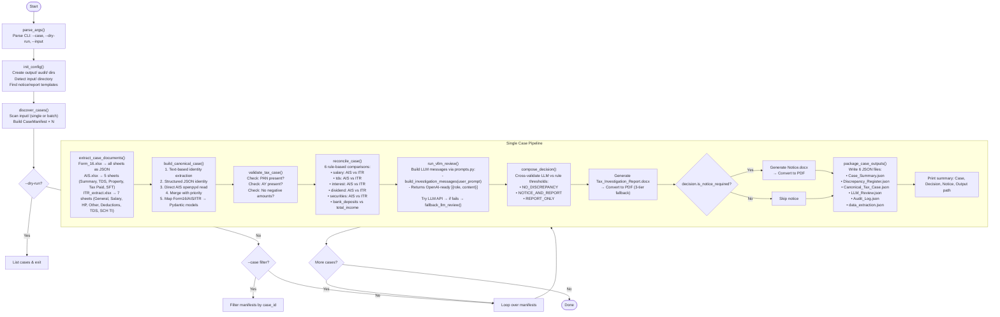

### Detailed Stage Breakdown

| Stage | Function | Input | Output | Key Logic |
|-------|----------|-------|--------|-----------|
| **1. Discovery** | `discover_cases()` | `input/` directory | `List[CaseManifest]` | Scans for single-case files or batch subfolders; validates 3 required files exist per case; computes SHA-256 hashes |
| **2. Extraction** | `extract_case_documents()` | CaseManifest files dict | `Dict[role, extraction_result]` | XLSX → pandas reads all sheets with `openpyxl`; DOCX → docling > python-docx > zip/XML fallback; plain text fallback for others |
| **3. Identity Resolution** | `build_canonical_case()` | Extracted docs + manifest | `TaxpayerIdentity` | 4 strategies merged: free-text regex, table rows, structured JSON sheets, direct openpyxl AIS read; case folder name as last resort |
| **4. Financial Mapping** | `map_*_to_canonical()` | Extracted docs | `Form16Data`, `AISData`, `ITRData` | Keyword-based amount extraction: `first_amount_after_keyword()` looks for "salary", "tds", "interest" etc. within 300 chars |
| **5. Validation** | `validate_tax_case()` | `CanonicalTaxCase` | `{is_valid, issues}` | Checks PAN presence, AY presence, 10 fields for negative values |
| **6. Discrepancy Analysis** | `reconcile_case()` | `CanonicalTaxCase` | `List[Discrepancy]` | 6 rules comparing source (AIS/Form16) vs declared (ITR); materiality bands: none(0), low(≤1K), medium(≤50K), high(>50K) |
| **7. LLM Review** | `run_vllm_review()` | Case + discrepancies + raw docs | `LLM review dict` | Builds messages via `build_investigation_messages()` from prompts.py; sends canonical data + all raw sheets to LLM; parses JSON response; falls back to deterministic if LLM unavailable |
| **8. Decision** | `compose_decision()` | Discrepancies + LLM review | `DecisionResult` | Cross-validates LLM against statutory thresholds; 3 decision types; LLM notice overridden if no threshold met |
| **9. Doc Generation** | `render_docx_template()` | Template + context | DOCX file | Jinja2 rendering via docxtpl; plain text fallback via python-docx; context includes discrepancies_block, llm_review etc. |
| **10. PDF Conversion** | `convert_docx_to_pdf()` | DOCX file | PDF file | LibreOffice headless → docx2pdf (Windows COM) → fpdf2 (pure Python); auto-downloads DejaVuSans font |
| **11. Output Packaging** | `package_case_outputs()` | All pipeline outputs | 6 JSON files | Writes Case_Summary, Discrepancy_Register, Canonical_Tax_Case, LLM_Review, Audit_Log, data_extraction.json |

---

## 4. Module-by-Module Deep Dive

### 4.1 `src/config.py` — Configuration & Template Detection

**Purpose:** Central configuration hub. Auto-detects input directories and DOCX templates.

**Key Components:**

```python
# LLM Configuration (runtime-evaluated — use get_llm_config() for fresh values)
VLLM_BASE_URL = "https://openrouter.ai/api/v1"          # Backward-compat import-time constant
MODEL_NAME = "qwen/qwen3.5-9b"                           # Backward-compat import-time constant
VLLM_API_KEY = os.getenv("ONLINE_LLM_KEY")              # Backward-compat import-time constant

# Prefer runtime config — reads .env each call
def get_llm_config(force_reload: bool = False) -> dict:
    """Returns {base_url, api_key, model, provider} from current environment."""

# Path resolution
BASE_DIR = Path.cwd()
SAMPLE_DIR = BASE_DIR / "sample"
OUTPUT_DIR = BASE_DIR / "output"
AUDIT_DIR = BASE_DIR / "audit"
```

**`init_config()`** bootstraps the system:
1. Creates `output/` and `audit/` directories
2. Auto-detects input directory (tries `Input` then `input`)
3. Auto-detects notice template from `sample/` (tries `Notice_Template.docx` → `notice.docx` → `Notice u.s 133(6).docx`)
4. Auto-detects report template (tries `input/` then `sample/`)
5. Uses `first_existing_path()` helper — returns first path that exists

**Template Detection Priority:**
| Template | Search Order |
|----------|-------------|
| Notice | `sample/Notice_Template.docx` → `sample/notice.docx` → `sample/Notice u.s 133(6).docx` |
| Report | `input/REPORT_TEMPLATE.docx` → `input/Report_Template.docx` → `input/report_template.docx` → `sample/Tax_Investigation_Report_Template.docx` → `sample/Tax_Investigation_Report.docx` → `sample/REPORT_TEMPLATE.docx` → `sample/report.docx` → `NOTICE_TEMPLATE_PATH` (fallback) |

### 4.2 `src/utils.py` — Shared Utilities

**Purpose:** Common helpers used across the system.

| Function | Description | Key Behavior |
|----------|-------------|--------------|
| `sha256_file()` | Compute SHA-256 hex digest | Reads file in 8KB chunks for memory efficiency |
| `now_iso()` | UTC ISO-8601 timestamp | Returns `2026-06-15T10:30:00Z` format |
| `safe_decimal()` | Parse decimal from string | Strips INR/Rs/$, handles commas, negative signs; returns Decimal("0") on failure |
| `ensure_dir()` | Create directory if missing | `mkdir(parents=True, exist_ok=True)` |
| `DocumentConverter` | docling import (optional) | Gracefully `None` if docling not installed |
| `DocxTemplate` | docxtpl import (optional) | Gracefully `None` if docxtpl not installed |
| `load_workbook` | openpyxl import (optional) | Gracefully `None` if openpyxl not installed |
| `Document` | python-docx import (optional) | Gracefully `None` if python-docx not installed |

### 4.3 `src/models.py` — Pydantic Data Models

**Purpose:** Structured representations of all tax data using Pydantic v2.

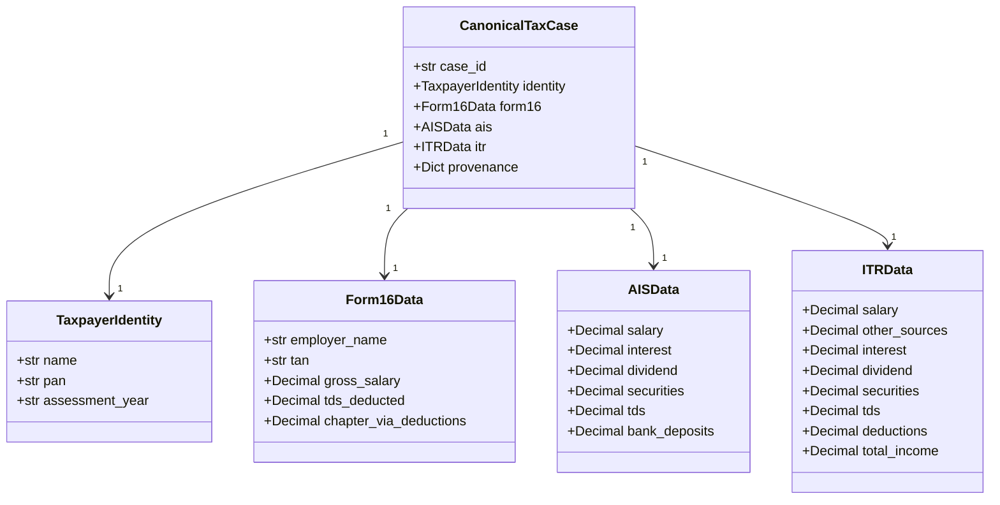

All financial fields default to `Decimal("0")` to avoid `None` arithmetic issues. The `provenance` dict in `CanonicalTaxCase` stores the full audit trail including the CaseManifest, source document metadata, and identity extraction debug info.

### 4.4 `src/parsing.py` — Text & Table Parsing

**Purpose:** Regex-based extraction of PAN, Assessment Year, taxpayer names, and numerical amounts.

**Compiled Patterns:**

```python
AMOUNT_RE = re.compile(r"(?<!\d)(?:\d{1,3}(?:,\d{2,3})*|\d+)(?:\.\d+)?(?!\d)")
PAN_RE = re.compile(r"\b[A-Z]{5}[0-9]{4}[A-Z]\b", re.I)  # ABCPE1234F
```

**Assessment Year Patterns (4 formats):**
- `AY 2025-26`
- `A.Y. 2025-26`
- `Assessment Year 2025-26`
- `Asst. Year 2025-26`

**Name Patterns (4 formats):**
- `Assessee Name: Rahul Sharma`
- `Taxpayer Name: Rahul Sharma`
- `Employee Name: Rahul Sharma`
- `Name: Rahul Sharma`

**Key Functions:**

| Function | Purpose | Strategy |
|----------|---------|----------|
| `extract_identity_from_text()` | Primary identity extraction | 3-pass: free-text regex → table rows → case folder name |
| `extract_identity_from_table_text()` | Table-aware extraction | Detects pipe-delimited rows; matches `PAN \| Name \| AY \| FY` header pattern |
| `extract_name_pan_ay_from_case_name()` | Folder name parsing | Extracts from `Rahul_Sharma_ABCPE1234F_2025-26` pattern |
| `first_amount_after_keyword()` | Financial value extraction | Searches 300-char window after keyword for first numeric value |
| `normalize_assessment_year()` | AY normalization | `2025-2026` → `2025-26`, `2025-26` → `2025-26` |
| `clean_name()` | Name sanitization | Strips special chars, rejects common labels (pan, name, ay, fy) |
| `flatten_text()` | Extraction result → string | Prefers markdown text, falls back to JSON dump |

### 4.5 `src/case_discovery.py` — Case Discovery

**Purpose:** Scans the input directory and builds `CaseManifest` objects describing each case.

**`CaseManifest` Dataclass:**
```python
@dataclass
class CaseManifest:
    case_id: str               # "CASE_001", "CASE_002", etc.
    case_name: str             # Folder name or "CASE_001"
    input_mode: str            # "single" or "batch"
    case_path: str             # Absolute path to case folder/input
    files: Dict[str, str]      # {"form16": "path", "ais": "path", "itr": "path"}
    template_path: str         # Path to notice template
    discovered_at: str         # ISO timestamp
    file_hashes: Dict[str, str] # SHA-256 of each file
```

**Two Operating Modes:**

| Mode | Structure | Example |
|------|-----------|---------|
| **Single** | All 3 files in `input/` root | `input/Form16.docx`, `input/AIS.xlsx`, `input/ITR_Extract.docx` |
| **Batch** | Subfolder per case | `input/Record_001_HLJWGL6617F_Vivaan/` containing 3 files each |

**File Name Aliasing (Flexible Matching):**
```python
FILE_ALIASES = {
    "form16": ["Form16.docx", "Form 16.docx", "Form_16.xlsx", "form_16.xlsx", ...],
    "ais":    ["AIS.docx", "AIS.xlsx", "ais.xlsx", ...],
    "itr":    ["ITR_Extract.docx", "ITR Extract.xlsx", "ITR.xlsx", ...],
}
```

`find_case_file()` uses case-insensitive and normalized-name lookup for loose matching.

### 4.6 `src/extraction.py` — Document Extraction

**Purpose:** Extract all content from DOCX and XLSX files, preserving every sheet.

**Extraction Dispatcher (`extract_with_docling()`):**

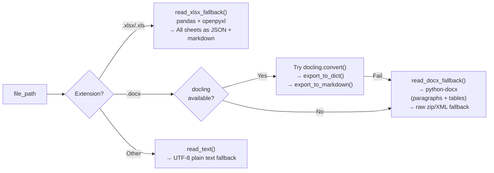

**XLSX Extraction (`read_xlsx_fallback()`):**
- Uses `pd.ExcelFile()` with `openpyxl` engine
- Iterates all sheets, converts each to list-of-dicts records
- Also produces pipe-delimited markdown representation
- Returns extraction result with `docling_json.sheets[sheet_name]` containing all row data

**DOCX Fallback Chain:**
1. **docling** (Document AI) — produces structured JSON + markdown
2. **python-docx** — reads paragraphs and table cells
3. **Raw ZIP/XML** — extracts `word/document.xml` and parses `<w:t>` elements

**Extraction Result Structure:**
```python
{
    "file_name": "AIS.xlsx",
    "source_path": "C:\\...\\AIS.xlsx",
    "extracted_at": "2026-06-15T10:30:00Z",
    "docling_json": {
        "sheets": {
            "Summary": [{"PAN": "ABCPE1234F", "Name": "Rahul", ...}],
            "Part A - TDS Summary": [...],
            ...
        }
    },
    "markdown": "# Sheet: Summary\nPAN | Name | AY | FY\n...",
    "extraction_method": "pandas-excel"
}
```

### 4.7 `src/mapping.py` — Canonical Mapping

**Purpose:** Converts raw extracted data into structured Pydantic models with multi-strategy identity resolution.

**Identity Resolution (4 strategies, merged with priority):**

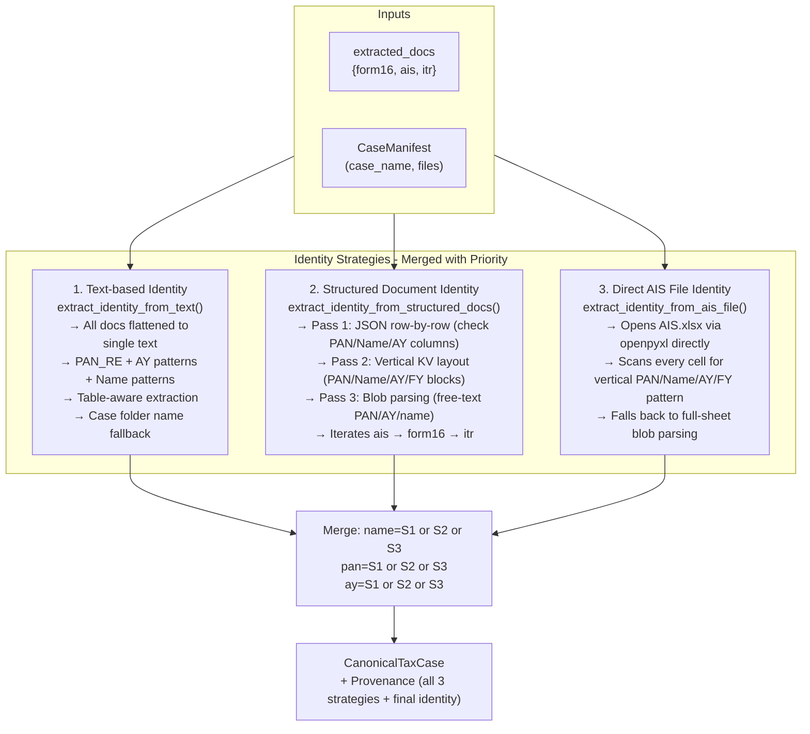

**Financial Data Mapping:**

| Function | Source Extraction | Target Model | Keyword Lookups |
|----------|-----------------|--------------|-----------------|
| `map_form16_to_canonical()` | extracted_docs["form16"] | `Form16Data` | "gross salary", "tds deducted", "chapter vi-a" |
| `map_ais_to_canonical()` | extracted_docs["ais"] | `AISData` | "salary", "interest", "dividend", "securities", "tds", "deposit" |
| `map_itr_to_canonical()` | extracted_docs["itr"] | `ITRData` | "salary", "other sources", "interest", "dividend", "securities", "tds", "deduction", "total income" |

All use `first_amount_after_keyword()` which searches a 300-character window after the keyword.

**Provenance Tracking:**
The `CanonicalTaxCase.provenance` dictionary stores:
- Full `CaseManifest` (asdict)
- Source document metadata for each role
- Identity debug info showing all 3 strategies and final merged identity

### 4.8 `src/validation.py` — Data Validation

**Purpose:** Quality checks on the canonical case.

**Validation Checks:**
1. **PAN presence** — `identity.pan is None` → "PAN not detected"
2. **AY presence** — `identity.assessment_year is None` → "Assessment year not detected"
3. **Negative amounts** — checked on 10 fields across Form16, AIS, ITR:
   - `form16.gross_salary`, `form16.tds_deducted`
   - `ais.salary`, `ais.interest`, `ais.dividend`, `ais.tds`
   - `itr.salary`, `itr.interest`, `itr.dividend`, `itr.tds`

**Output:**
```python
{"is_valid": True/False, "issues": ["PAN not detected", ...]}
```

### 4.9 `src/discrepancies.py` — Discrepancy Engine

**Purpose:** Deterministic rule-based comparison between source documents (Form16/AIS) and ITR declarations.

**Discrepancy Dataclass:**
```python
@dataclass
class Discrepancy:
    discrepancy_id: str         # UUID
    category: str               # "salary", "tds", "interest", "dividend", "securities", "bank_deposits_vs_total_income"
    source_reported_value: str  # From Form16/AIS
    declared_value: str         # From ITR
    delta: str                  # source - declared
    materiality: str            # "none", "low", "medium", "high"
    severity: str               # "none", "low", "medium", "high"
    notice_candidate: bool      # Triggers notice threshold?
    manual_review_required: bool
    reason: str                 # Human-readable explanation
```

**6 Reconciliation Rules:**

| # | Category | Source Field | Declared Field | Description |
|---|----------|-------------|----------------|-------------|
| 1 | salary | AIS.salary (or Form16.gross_salary if AIS=0) | ITR.salary | Salary mismatch |
| 2 | tds | AIS.tds (or Form16.tds_deducted if AIS=0) | ITR.tds | TDS mismatch |
| 3 | interest | AIS.interest | ITR.interest | Interest income mismatch |
| 4 | dividend | AIS.dividend | ITR.dividend | Dividend mismatch |
| 5 | securities | AIS.securities | ITR.securities | Securities disclosure mismatch |
| 6 | bank_deposits_vs_total_income | AIS.bank_deposits | ITR.total_income | Bank deposits vs declared income |

**Materiality Thresholds:**
```python
| Delta Abs Value | Band    | notice_trigger |
|-----------------|---------|----------------|
| 0               | "none"  | No             |
| 1 – 1,000       | "low"   | No             |
| 1,001 – 50,000  | "medium"| No             |
| > 50,000        | "high"  | Yes (general)  |
| > 100,000       | "high"  | Yes (bank_deposits) |
```

**Notice Trigger per Indian Tax Law:**
- General categories (salary, TDS, interest, dividend, securities): delta > ₹50,000
- Bank deposits vs total income (Section 68/69): delta > ₹1,00,000

### 4.10 `src/prompts.py` — Centralized Prompt Registry

**Purpose:** Single source of truth for all LLM prompts. Eliminates prompt duplication and enables safe, fast prompt tuning without touching business logic.

**Prompt Constants:**

| Constant | Purpose |
|----------|---------|
| `INVESTIGATION_SYSTEM_PROMPT` | Forensic tax officer persona with full analysis instructions (cross-referencing, materiality assessment, validation steps) |
| `STRICT_JSON_ENFORCER` | JSON-only output enforcer with complete schema definition |

**Helper Function:**

```python
def build_investigation_messages(user_prompt: str) -> list[dict]:
    """Build OpenAI-format messages for investigation review."""
    system_prompt = INVESTIGATION_SYSTEM_PROMPT + "\n" + STRICT_JSON_ENFORCER
    return [
        {"role": "system", "content": system_prompt},
        {"role": "user", "content": user_prompt},
    ]
```

**Key Design Decisions:**
- Uses `langchain_core.messages.SystemMessage` / `HumanMessage` internally for structured message construction
- Returns plain dicts (`[{role, content}]`) for direct OpenAI API compatibility
- No LangChain object conversion needed in the caller — keeps `llm_reviewer.py` clean
- Ready for future A/B testing, prompt versioning, and experiment tracking

**What Changed:**
| Before (BAD) | After (CLEAN) |
|--------------|---------------|
| Prompts hardcoded inline in `llm_reviewer.py` | All prompts in `src/prompts.py` |
| System prompt duplicated & overwritten in `run_vllm_review()` | Single definition via `build_investigation_messages()` |
| Raw dict message construction | LangChain `SystemMessage` / `HumanMessage` |
| Direct OpenAI SDK + httpx API calls | LangChain `ChatOpenAI` / `ChatOllama` unified interface |
| Static import-time config | Runtime `get_llm_config()` reads `.env` per call |
| Difficult to tune without touching code | Edit `prompts.py` with zero code risk |

### 4.11 `src/llm_reviewer.py` — LLM Forensic Review

**Purpose:** Universal LLM interface for forensic tax analysis with deterministic fallback. **Prompts are now sourced from `src/prompts.py`** — no inline prompt text remains.

**Supported LLM Providers:**

```python
def _detect_provider(base_url: str) -> str:
    # "openrouter" — https://openrouter.ai/api/v1
    # "openai"     — https://api.openai.com/v1
    # "vllm"       — http://localhost:8000/v1
    # "ollama"     — http://localhost:11434/v1
    # "local"      — Any other local endpoint
    # "custom"     — Any remote endpoint
```

**Client Factory:** Uses LangChain `ChatOpenAI` (OpenAI-compatible) or `ChatOllama` (native Ollama). Auto-detects provider from base URL via `_create_chat_model()`.

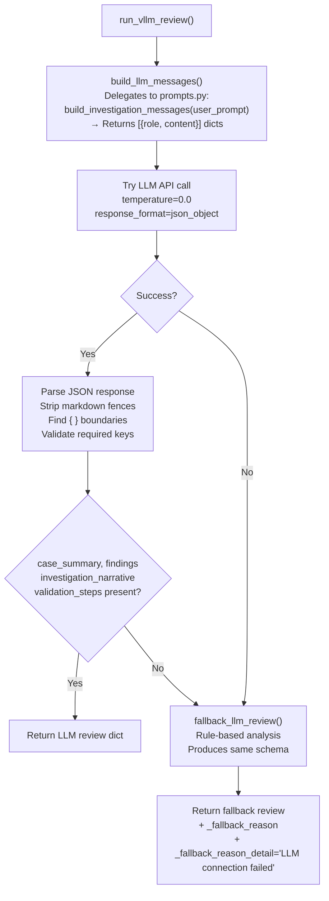

**Message Construction (`build_llm_messages()`):**
- Builds user prompt with canonical_case + precomputed_discrepancies + raw_extracted_documents
- Delegates system prompt construction to `prompts.py` via `build_investigation_messages()`
- No hardcoded system prompt text — single source of truth in `prompts.py`

**LLM Output Schema:**

```json
{
  "case_summary": {
    "overall_risk": "low|medium|high",
    "material_discrepancy_count": 0,
    "manual_review_required": true,
    "notice_candidate": true,
    "summary_text": "string"
  },
  "findings": [{
    "finding_id": "string",
    "category": "string",
    "status": "confirmed|probable|uncertain",
    "materiality": "low|medium|high",
    "difference_summary": "string",
    "reasoning": "string",
    "source_support": ["string"],
    "sheet_references": ["string"],
    "manual_review_required": true
  }],
  "investigation_narrative": {
    "facts_established": ["string"],
    "issues_observed": ["string"],
    "uncertainties": ["string"],
    "recommended_next_step": "no_action|manual_review|issue_notice"
  },
  "validation_steps": [{
    "step_id": "string",
    "description": "string",
    "priority": "high|medium|low",
    "responsible_party": "assessee|deductor|bank|registry|third_party",
    "document_requested": "string",
    "legal_basis": "string"
  }]
}
```

**Deterministic Fallback (`fallback_llm_review()`):**
When LLM is unavailable, produces the same schema using rule-based logic:
- Risk determined by materiality counts + notice_candidate status
- Findings mapped directly from discrepancy engine results
- Validation steps generated from notice_candidate + high severity flags
- Two standard steps: Section 133(6) notice call and TDS verification with TRACES
- Sets `_fallback_reason` and `_fallback_reason_detail = "LLM connection failed"` markers

### 4.12 `src/decision.py` — Decision Composer

**Purpose:** Final decision making — cross-validates LLM recommendation against statutory thresholds.

**Decision Types:**
| Type | When | Action |
|------|------|--------|
| `NO_DISCREPANCY` | No discrepancies at all | Report only (no notice) |
| `REPORT_ONLY` | Discrepancies exist but below notice thresholds | Report only (no notice) |
| `NOTICE_AND_REPORT` | One or more discrepancies trigger notice | Report + Notice |

**Decision Logic Flow:**

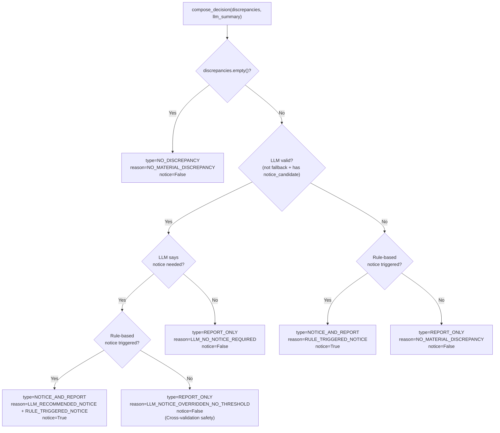

**Key Safety Feature:** If the LLM recommends a notice but no discrepancy meets the statutory threshold (e.g., ₹50K general, ₹1L bank deposits), the system overrides the LLM to prevent unnecessary notices.

### 4.13 `src/document_gen.py` — Document Generation

**Purpose:** Generate DOCX reports/notices from Jinja2 templates and convert to PDF.

**Template Rendering Flow:**

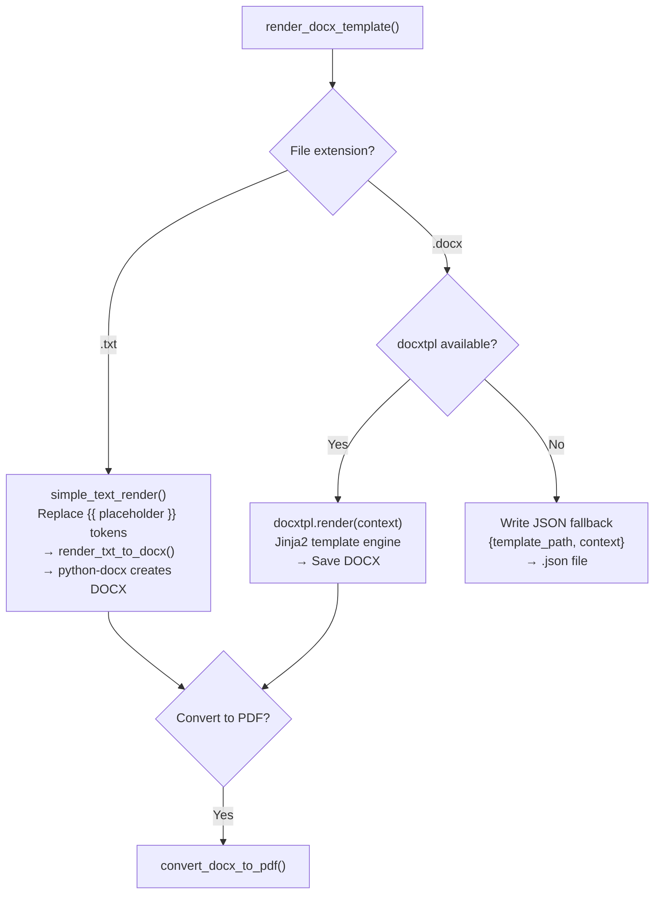

**Template Context (`default_notice_context()`):**

| Variable | Source | Example |
|----------|--------|---------|
| `case_id` | `{Name}_{PAN}_{AY}` | `Rahul_Sharma_ABCPE1234F_2025-26` |
| `assessee_name` | `canonical_case.identity.name` | `Rahul Sharma` |
| `pan` | `canonical_case.identity.pan` | `ABCPE1234F` |
| `assessment_year` | `canonical_case.identity.assessment_year` | `2025-26` |
| `financial_year` | Derived: AY-1 → FY | `2024-25` |
| `decision_type` | `decision.decision_type` | `NOTICE_AND_REPORT` |
| `reason_codes` | Joined reason codes | `LLM_RECOMMENDED_NOTICE\nRULE_TRIGGERED_NOTICE` |
| `discrepancies` | List of discrepancy dicts | Full register |
| `discrepancies_block` | Pre-formatted text | Numbered list with fields |
| `generated_at` | ISO timestamp | `2026-06-15T10:30:00Z` |

**PDF Conversion (3-tier fallback):**

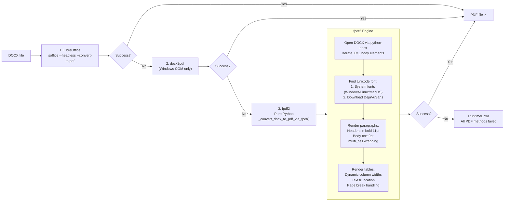

**fpdf2 Unicode Font Detection:**
Searches 16+ font paths across Windows, Linux, macOS (Intel + Apple Silicon). Falls back to downloading DejaVuSans from GitHub's `dejavu-fonts` repository.

### 4.14 `src/output.py` — Output Packaging

**Purpose:** Writes all case outputs as structured JSON files.

**6 JSON Files Generated per Case:**

| File | Content | Purpose |
|------|---------|---------|
| `Case_Summary.json` | Decision overview + generated files list | Quick reference |
| `Discrepancy_Register.json` | All discrepancies (list of dicts) | Audit trail |
| `Canonical_Tax_Case.json` | Full structured case data | Machine-readable case record |
| `LLM_Review.json` | LLM forensic analysis (or fallback) | Review documentation |
| `Audit_Log.json` | Manifest + validation + decision | Complete provenance |
| `data_extraction.json` | Raw extracted sheet data (all sheets, all docs) | Full data for re-analysis |

**Output Directory Structure:**
```
output/
└── Rahul_Sharma_ABCPE1234F_20260615_103000/
    ├── Case_Summary.json
    ├── Canonical_Tax_Case.json
    ├── Discrepancy_Register.json
    ├── LLM_Review.json
    ├── Audit_Log.json
    ├── data_extraction.json
    ├── Tax_Investigation_Report.docx
    ├── Tax_Investigation_Report.pdf
    ├── Notice.docx                          (only if notice required)
    └── Notice.pdf                           (only if notice required)
```

---

## 5. Data Models

### Entity Relationship Diagram

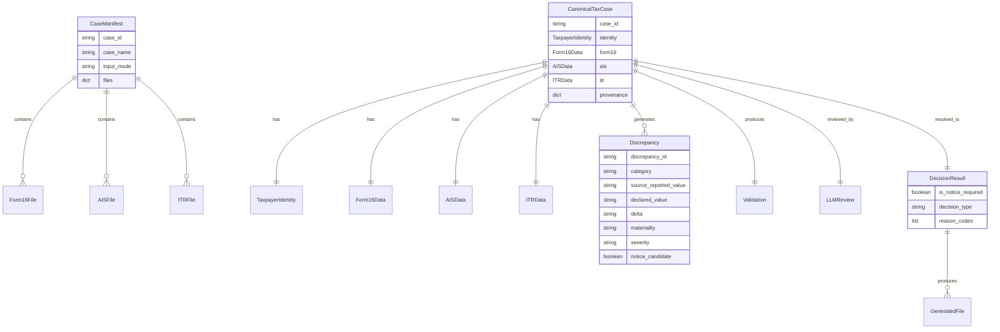

### Financial Field Mapping (Source → ITR Comparison)

| Financial Concept | Form 16 Field | AIS Field | ITR Field |
|-------------------|---------------|-----------|-----------|
| Salary | gross_salary | salary | salary |
| TDS | tds_deducted | tds | tds |
| Interest | — | interest | interest |
| Dividend | — | dividend | dividend |
| Securities | — | securities | securities |
| Bank Deposits | — | bank_deposits | total_income (for comparison) |

---

## 6. Configuration System

### Configuration Priority (highest to lowest):
1. Environment variables (`.env` file)
2. `src/config.py` defaults
3. CLI arguments (`--input`, `--case`, `--dry-run`)

### Key Configuration Parameters:

| Parameter | Default | Env Var (priority order) | Description |
|-----------|---------|--------------------------|-------------|
| Base URL | `https://openrouter.ai/api/v1` | `LLM_BASE_URL` > `VLLM_BASE_URL` | LLM API endpoint |
| Model | `qwen/qwen3.5-9b` | `LLM_MODEL` > `VLLM_MODEL_NAME` | LLM model name |
| API Key | `None` | `OPENAI_API_KEY` > `ONLINE_LLM_KEY` > `VLLM_API_KEY` | Auth token |
| LibreOffice | `soffice` (win) / `libreoffice` (nix) | `LIBREOFFICE_CMD` | PDF conversion tool |
| Input Dir | Auto-detected | — | Case file directory |
| Output Dir | `./output` | — | Output directory |
| Audit Dir | `./audit` | — | Audit log directory |

### Runtime Config (`get_llm_config()`)

LLM settings are fetched at runtime via `get_llm_config(force_reload=False)` in `src/config.py`. This means environment changes take effect on each call without restarting Python. Use `force_reload=True` to re-read `.env` with override.

**Provider auto-detection** inspects the base URL:

| URL pattern | Provider | API Key Behavior |
|-------------|----------|-----------------|
| `openrouter` | OpenRouter | Requires valid key |
| `openai` | OpenAI | Requires valid key |
| `localhost:8000` | vLLM | Uses `"dummy"` |
| `localhost:11434` | Ollama | Uses `"ollama"`, auto-appends `/v1` |
| Other | Custom | User-supplied key required |

### Template Auto-Detection:
Uses `first_existing_path()` to search multiple candidate paths for templates, making the system work with minimal configuration.

### Input Directory Auto-Detection:
```python
INPUT_DIR = first_existing_path([
    BASE_DIR / "Input",
    BASE_DIR / "input",
])
```

---

## 7. Centralized Prompt Management

### Architecture

The system uses an enterprise-grade **3-layer prompt architecture**:

```
src/prompts.py              ← ALL prompts (single source of truth)
        ↓
src/llm_reviewer.py         ← orchestration only (no hardcoded prompt text)
        ↓
LangChain (ChatOpenAI / ChatOllama)
        ↓
OpenRouter / vLLM / Ollama  ← LLM provider
```

### Why This Matters

| Aspect | Before (BAD) | After (CLEAN) |
|--------|--------------|---------------|
| Prompt location | Hardcoded inline in `llm_reviewer.py` | `src/prompts.py` — single registry |
| System prompt usage | Defined once, then overwritten by duplicate code | Defined once via `build_investigation_messages()` |
| Message construction | Raw Python dicts | LangChain `SystemMessage` / `HumanMessage` |
| LLM client | Direct OpenAI SDK + httpx calls | LangChain `ChatOpenAI` / `ChatOllama` unified interface |
| Configuration | Static import-time constants | Runtime `get_llm_config()` reads `.env` per call |
| Prompt tuning | Must edit business logic code | Edit `prompts.py` — zero code risk |
| Extensibility | None — prompts were scattered | Ready for A/B testing, versioning, experiment tracking |

### What Was Changed

| File | Action | Details |
|------|--------|---------|
| `src/prompts.py` | **NEW** | Centralized prompt registry with `INVESTIGATION_SYSTEM_PROMPT`, `STRICT_JSON_ENFORCER`, and `build_investigation_messages()` helper returning OpenAI-ready dicts |
| `src/llm_reviewer.py` | **MODIFIED** | Removed inline `system_prompt` definition (~25 lines); removed duplicate system prompt override in `run_vllm_review()` (~55 lines); now delegates to `build_investigation_messages()` from `prompts.py`; replaced OpenAI SDK + httpx with LangChain `ChatOpenAI`/`ChatOllama` via `_create_chat_model()`; uses `get_llm_config()` for runtime config |
| `src/config.py` | **MODIFIED** | Added `get_llm_config(force_reload=False)` for runtime-evaluated LLM settings; backward-compat constants kept |
| `requirements.txt` | **MODIFIED** | Added `langchain-core>=0.3,<1.0`, `langchain-openai>=0.2,<1.0`, `langchain-ollama>=0.2,<1.0`; removed `httpx>=0.27,<1.0` |

### Prompt Registry (`src/prompts.py`)

**`INVESTIGATION_SYSTEM_PROMPT`**
- Persona: Senior Indian Income Tax Officer
- Sources: Pre-computed discrepancies + raw extracted documents (all sheets)
- Analysis instructions: cross-reference, identify additional issues, assess materiality, recommend validation steps

**`STRICT_JSON_ENFORCER`**
- Complete JSON schema for the LLM response
- Instruction to output ONLY valid JSON (no explanation, no markdown, no extra text)
- Notice candidate guidance per Income Tax Act materiality thresholds

**`build_investigation_messages(user_prompt)`**
- Concatenates `INVESTIGATION_SYSTEM_PROMPT + "\n" + STRICT_JSON_ENFORCER`
- Returns `[{"role": "system", "content": ...}, {"role": "user", "content": ...}]`
- Uses LangChain `SystemMessage` / `HumanMessage` internally

### Future Extensions

The architecture is designed for easy extension:

```python
# Add A/B prompt variants
INVESTIGATION_SYSTEM_PROMPT_V2 = """..."""
INVESTIGATION_SYSTEM_PROMPT_V3 = """..."""

# Add version lookup
PROMPT_REGISTRY = {
    "v1": INVESTIGATION_SYSTEM_PROMPT,
    "v2": INVESTIGATION_SYSTEM_PROMPT_V2,
}
```

---

## 8. LLM Integration

### Architecture

The LLM integration uses **LangChain** (`ChatOpenAI` for OpenAI-compatible endpoints, `ChatOllama` for native Ollama), making it compatible with virtually any modern LLM serving infrastructure through a unified interface.

**Supported Providers:**

| Provider | Base URL Pattern | Auth | LangChain Client |
|----------|-----------------|------|------------------|
| OpenRouter | `https://openrouter.ai/api/v1` | `OPENAI_API_KEY` | `ChatOpenAI` |
| OpenAI | `https://api.openai.com/v1` | `OPENAI_API_KEY` | `ChatOpenAI` |
| vLLM | `http://localhost:8000/v1` | `"dummy"` (auto) | `ChatOpenAI` |
| Ollama | `http://localhost:11434` | `"ollama"` (auto) | `ChatOllama` |
| Custom | Any URL | User-supplied | `ChatOpenAI` |

**Provider Auto-Detection:**
```python
def _detect_provider(base_url: str) -> str:
    # Checks URL for keywords: openrouter, openai, localhost/8000 (vLLM),
    # localhost/11434 (ollama), other local (local), anything else (custom)
```

**Client Factory (`_create_chat_model()`):**
```python
from langchain_openai import ChatOpenAI
from langchain_ollama import ChatOllama

def _create_chat_model(temperature=0.0, response_format=None):
    cfg = get_llm_config()  # fresh config every call
    provider = cfg["provider"]
    if provider == "ollama":
        return ChatOllama(model=cfg["model"], base_url=cfg["base_url"], temperature=temperature)
    return ChatOpenAI(
        model=cfg["model"],
        base_url=cfg["base_url"],
        api_key=cfg["api_key"],
        temperature=temperature,
        model_kwargs={"response_format": response_format} if response_format else {}
    )
```

### Message Construction (`build_llm_messages()`):

**System Prompt (from `prompts.py`):** Persona of a senior Indian Income Tax Officer. Instructs to:
1. Cross-reference pre-computed discrepancies against raw sheet data
2. Identify additional discrepancies not caught by rules
3. Assess materiality per IT Act thresholds
4. Recommend validation steps with legal basis
5. Output only valid JSON matching the schema

**User Prompt Data:**
```json
{
    "canonical_case": { ... },
    "validation": { "is_valid": true, "issues": [] },
    "precomputed_discrepancies": [ ... ],
    "raw_extracted_documents": {
        "form16": { "docling_json": {"sheets": {...}}, "markdown": "..." },
        "ais":    { "docling_json": {"sheets": {...}}, "markdown": "..." },
        "itr":    { "docling_json": {"sheets": {...}}, "markdown": "..." }
    }
}
```

### Response Handling:
1. LangChain `.invoke()` returns structured response from `ChatOpenAI` / `ChatOllama`
2. When `response_format={"type":"json_object"}` is set, `JsonOutputParser` extracts the JSON
3. Strips markdown code fences (```json ... ```)
4. Falls back to finding outermost `{ }` boundaries
5. Validates all 4 required keys exist
6. If parsing fails → falls back to deterministic analysis

### Fallback:
When the LLM is unavailable (network error, server down, invalid API key), `fallback_llm_review()` produces the identical schema using purely rule-based logic. The output is marked with `_fallback_reason` and `_fallback_reason_detail` flags.

### LLM Output Usage in Decision:
The `case_summary.notice_candidate` field from the LLM is cross-validated against rule-based thresholds in `compose_decision()`. If the LLM recommends a notice but no discrepancy meets the statutory threshold, the system overrides to prevent unnecessary notices.

---

## 9. Discrepancy Engine

### Architecture

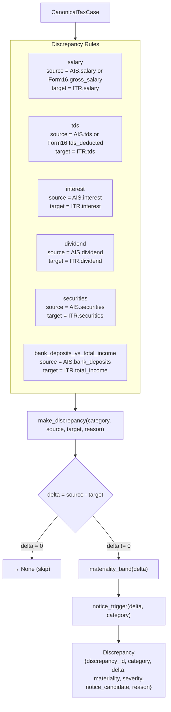

### Notice Triggers per Indian Tax Law:

| Category | Threshold | Legal Reference |
|----------|-----------|-----------------|
| Salary, TDS, Interest, Dividend, Securities | > ₹50,000 | General materiality |
| Bank Deposits vs Total Income | > ₹1,00,000 | Section 68/69 |

### Materiality Classification:

| Delta Abs | Band | Color | Action |
|-----------|------|-------|--------|
| 0 | none | — | Skipped entirely |
| 1 – 1,000 | low | Green | Logged, no action |
| 1,001 – 50,000 | medium | Yellow | Logged, no notice |
| > 50,000 | high | Red | Notice candidate + manual review |

---

## 10. Decision Logic

### Decision Flow (Extended)

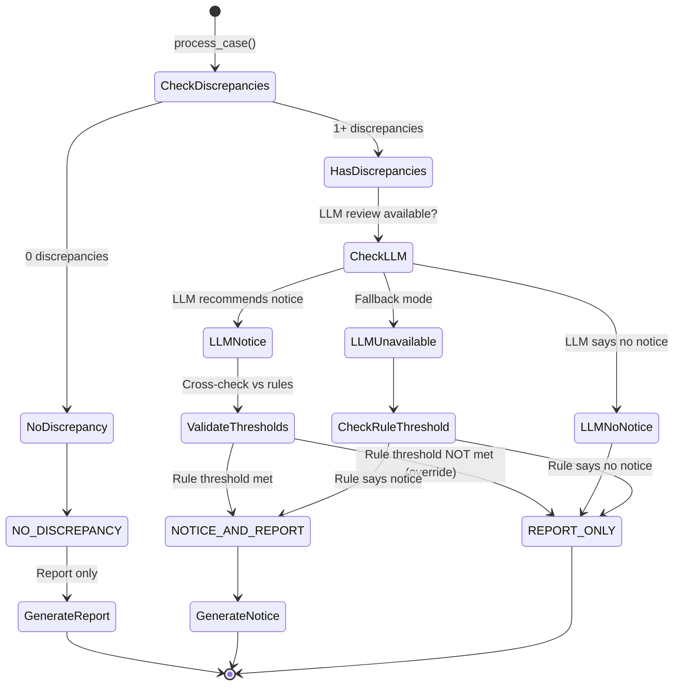

### Reason Codes:

| Code | Meaning | Scenario |
|------|---------|----------|
| `NO_MATERIAL_DISCREPANCY` | No meaningful differences found | No discrepancies, or all below threshold |
| `LLM_RECOMMENDED_NOTICE` | LLM deemed notice warranted | LLM + rule threshold both met |
| `RULE_TRIGGERED_NOTICE` | Rule-based threshold exceeded | Fallback mode + threshold met |
| `LLM_NO_NOTICE_REQUIRED` | LLM cleared the case | No threshold violation per LLM |
| `LLM_NOTICE_OVERRIDDEN_NO_THRESHOLD` | LLM wanted notice but no threshold met | Safety override |

---

## 11. Document Generation

### Template Processing

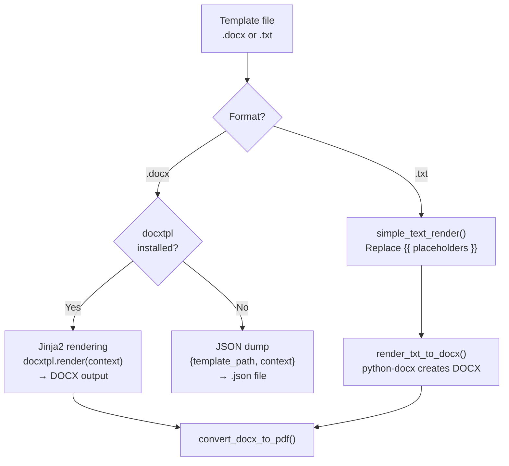

### Available Template Variables:

| Variable | Type | Example |
|----------|------|---------|
| `{{ assessee_name }}` | string | `Rahul Sharma` |
| `{{ pan }}` | string | `ABCPE1234F` |
| `{{ assessment_year }}` | string | `2025-26` |
| `{{ financial_year }}` | string | `2024-25` |
| `{{ case_id }}` | string | `Rahul_Sharma_ABCPE1234F_2025-26` |
| `{{ decision_type }}` | string | `NOTICE_AND_REPORT` |
| `{{ reason_codes }}` | string (multi-line) | `LLM_RECOMMENDED_NOTICE` |
| `{{ discrepancies_block }}` | string (multi-line) | Numbered discrepancy list |
| `{{ generated_at }}` | string | `2026-06-15T10:30:00Z` |
| `{{ report_title }}` | string (report only) | `Tax Investigation Report` |
| `{{ notice_title }}` | string (notice only) | `Notice under Section 133(6)` |
| `{{ llm_review }}` | dict (report only) | Full LLM analysis |

### PDF Conversion — 3-Tier Fallback

| Method | Quality | Dependencies | Platform |
|--------|---------|-------------|----------|
| **LibreOffice** | Best (faithful DOCX→PDF) | LibreOffice installed | Cross-platform |
| **docx2pdf** | Good (Word COM) | Microsoft Word | Windows only |
| **fpdf2** | Acceptable (text+table) | None (pure Python) | Cross-platform |

The fpdf2 engine:
- Preserves paragraphs with formatting (bold headers, body text)
- Handles tables with dynamic column widths
- Auto-detects or downloads Unicode fonts (supports ₹, Indian tax characters)
- Falls back to ASCII replacement if no Unicode font available

---

## 12. Output Packaging

### File Generation Rules

| Scenario | Case_Summary | Discrepancy Register | Canonical Case | LLM Review | Audit Log | data_extraction | Report DOCX | Report PDF | Notice DOCX | Notice PDF |
|----------|:---:|:---:|:---:|:---:|:---:|:---:|:---:|:---:|:---:|:---:|
| No discrepancies | ✓ | ✓ (empty) | ✓ | ✓ | ✓ | ✓ | ✓ | ✓ | ✗ | ✗ |
| Minor discrepancies | ✓ | ✓ | ✓ | ✓ | ✓ | ✓ | ✓ | ✓ | ✗ | ✗ |
| Notice-triggered | ✓ | ✓ | ✓ | ✓ | ✓ | ✓ | ✓ | ✓ | ✓ | ✓ |
| No template found | ✓ | ✓ | ✓ | ✓ | ✓ | ✓ | ✗ (JSON fallback) | ✗ | ✗ (JSON fallback) | ✗ |
| PDF conversion fails | ✓ | ✓ | ✓ | ✓ | ✓ | ✓ | ✓ | ✗ (error logged) | ✓ | ✗ |

### Output JSON Schema Summary

**Case_Summary.json:**
```json
{
    "case_id": "CASE_001",
    "decision_type": "NOTICE_AND_REPORT",
    "is_notice_required": true,
    "reason_codes": ["RULE_TRIGGERED_NOTICE"],
    "generated_at": "2026-06-15T10:30:00Z",
    "generated_files": {
        "report_docx": "output/.../Tax_Investigation_Report.docx",
        "report_pdf": "output/.../Tax_Investigation_Report.pdf",
        "notice_docx": "output/.../Notice.docx",
        "notice_pdf": "output/.../Notice.pdf"
    }
}
```

---

## 13. Testing Suite

### Test Architecture

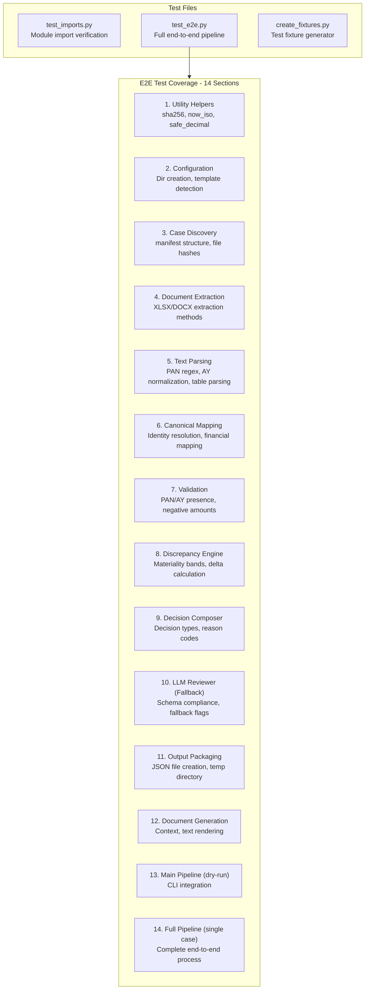

**test_e2e.py** runs all 14 test sections sequentially. It:
- Bootstraps config first
- Cleans old output directories
- Runs `subprocess` calls to `main.py --dry-run` and `main.py --case CASE_001`
- Tests all modules in dependency order
- Verifies output files and JSON structure
- Exits with non-zero on any failure

**test_imports.py** verifies all 13 modules import successfully, catching circular dependency issues early.

---

## 14. Utility Scripts

### `create_compliant_records.py`

Generates 11 compliant test records (Record_100 to Record_110) with zero discrepancies. Creates:
- `Form_16.xlsx` — 5 rows (Q1-Q4 + Total) with matching salary/TDS
- `AIS.xlsx` — 5 sheets (Summary, TDS Summary, Property, Tax Paid, SFT)
- `ITR_extract.xlsx` — 7 sheets (General, Salary, House Property, Other Sources, Deductions, TDS/Bank, SCH TI)

Values are designed to be internally consistent so no notices would be triggered.

### `create_truly_compliant_records.py`

Improved version with simpler, truly matching data. Uses empty sheets in AIS/ITR to avoid spurious discrepancies from `first_amount_after_keyword()` matching unintended numbers.

### `tests/create_fixtures.py`

Creates minimal test fixtures for E2E testing:
- `sample/Notice_Template.docx` — Jinja2 template with `{{ assessee_name }}`, `{{ pan }}`, etc.
- `sample/Tax_Investigation_Report_Template.docx` — Jinja2 report template
- `input/Form16.docx` — Sample Form 16 with ₹1,200,000 salary
- `input/AIS.xlsx` — Sample AIS with 6 category rows
- `input/ITR_Extract.docx` — Sample ITR with matching values

---

## 15. Input Data Structure

### Case File Requirements

Each case requires exactly 3 files (flexible naming):

| Document | Purpose | AIS Sheets (expected) | ITR Sheets (expected) |
|----------|---------|----------------------|----------------------|
| **Form 16** | Employer salary/TDS certificate | — | — |
| **AIS** | Annual Information Statement | Summary, Part A - TDS Summary, Part A2 Property, Part C Tax Paid, Part E SFT | — |
| **ITR Extract** | Income Tax Return data | — | Part A- General Details, Salary, House Property, Other Sources, Deductions, TDS and Bank details, SCH TI |

### Supported File Name Variations:
| Required File | Accepted Names |
|---------------|----------------|
| Form 16 | `Form16.docx/xlsx`, `Form 16.docx/xlsx`, `form16.docx/xlsx`, `Form_16.xlsx`, `form_16.docx/xlsx` |
| AIS | `AIS.docx/xlsx`, `ais.docx/xlsx` |
| ITR Extract | `ITR_Extract.docx/xlsx`, `ITR Extract.docx/xlsx`, `itr_extract.docx/xlsx`, `ITR.docx/xlsx` |

### Input Record Coverage (Existing Data):
- **Records 001-010**: GOOD — all documents internally consistent
- **Records 011-100**: DISCREPANCY — 90 distinct types:
  - **CRITICAL (16)**: SFT mismatch, crypto, GST, foreign assets, shell companies, transfer pricing, cash loan violations
  - **HIGH (39)**: income suppression, TDS over-claim, capital gains, rental suppression, director remuneration, NRI status
  - **MEDIUM (33)**: 80C/80D/80EEA limits, HRA, advance tax interest, ITR form errors
  - **LOW (2)**: refund interest, minor issues
- **Records 100-110**: GOOD (compliant — zero discrepancies expected)

---

## 16. Supported File Formats

| Format | Extension | Extraction Method | Fallback Chain |
|--------|-----------|-------------------|----------------|
| Excel Workbook | `.xlsx`, `.xls` | pandas + openpyxl (all sheets) | — (direct) |
| Word Document | `.docx` | docling → python-docx → raw zip/XML | 3 levels |
| Plain Text | `.txt`, `.csv`, etc. | UTF-8 read | — (direct) |
| DOCX Template | `.docx` (template) | docxtpl (Jinja2) → python-docx → JSON | 3 levels |
| Text Template | `.txt` (template) | Placeholder replacement | — (direct) |

---

## 17. Error Handling & Fallbacks

### Fallback Chain Overview

```mermaid
flowchart TD
    subgraph EXTRACTION [Extraction Fallbacks]
        DOCLING["docling"] -->|fail| PYTHON_DOCX["python-docx"]
        PYTHON_DOCX -->|fail| ZIP_XML["Raw ZIP/XML"]
    end

    subgraph LLM [LLM Review Fallbacks]
        API["LLM API"] -->|fail| DETERMINISTIC["Deterministic Fallback<br/>Same schema, rule-based"]
    end

    subgraph PDF [PDF Generation Fallbacks]
        LO["LibreOffice"] -->|fail| DOCX2PDF["docx2pdf (Windows)"]
        DOCX2PDF -->|fail| FPDF["fpdf2 (Pure Python)"]
    end

    subgraph TEMPLATE [Template Render Fallbacks]
        DOCXTPL["docxtpl"] -->|fail| JSON_FALLBACK["JSON Fallback File"]
    end
```

### Graceful Degradation per Module:

| Module | Normal Path | Fallback 1 | Fallback 2 | Ultimate Fallback |
|--------|-------------|------------|------------|-------------------|
| Extraction (DOCX) | docling | python-docx | Raw ZIP/XML | RuntimeError |
| Extraction (XLSX) | pandas+openpyxl | — | — | RuntimeError |
| LLM Review | OpenAI API | — | — | Deterministic rule-based (same schema) |
| PDF Generation | LibreOffice headless | docx2pdf (Windows COM) | fpdf2 pure Python | RuntimeError (with clear message) |
| Template Render | docxtpl (Jinja2) | JSON fallback | — | ValueError (unsupported format) |
| Decision | LLM + rule cross-validation | Rule-only (LLM fallback) | — | Default REPORT_ONLY |
| Identity | Free-text → structured → AIS file | Case folder name | — | None/unknown |

### Key Robustness Patterns:

1. **Optional imports**: All third-party libraries (`docling`, `docxtpl`, `openpyxl`, `python-docx`) are imported with try/except and set to `None` if missing
2. **Graceful LLM degradation**: If LLM call fails for any reason (network, auth, timeout), falls back to deterministic analysis producing identical schema
3. **Safety override**: LLM notice recommendation overridden if no statutory threshold met — prevents erroneous notices
4. **Cross-platform font detection**: Searches 16+ font paths across Windows/Linux/macOS before downloading DejaVuSans
5. **JSON fallbacks**: Any DOCX generation failure produces a structured JSON file with all context data preserved
6. **Strict JSON parsing**: LLM responses are cleaned (strip markdown, find `{}` boundaries, validate schema) before acceptance

---

## 18. Usage Guide

### Command Line Interface

```bash
# Process all discovered cases
python main.py

# List cases without processing
python main.py --dry-run

# Process a specific case
python main.py --case CASE_001

# Use custom input directory
python main.py --input /path/to/cases

# Using launcher scripts (auto-creates .venv if needed)
./run.sh                # Linux/macOS
run.bat                 # Windows
./run.sh --dry-run      # With arguments
```

### Environment Setup

```bash
# Create virtual environment
py -3.11 -m venv .venv
source .venv/bin/activate           # Linux/macOS
.venv\Scripts\activate              # Windows

# Install dependencies
pip install -r requirements.txt

# Configure LLM (create .env file)
echo "OPENAI_API_KEY=your_key_here" > .env
echo "LLM_BASE_URL=https://openrouter.ai/api/v1" >> .env
echo "LLM_MODEL=qwen/qwen3.5-9b" >> .env

# Run
python main.py
```

### Quick Start Checklist

1. Place case files in `input/` (single or batch mode)
2. (Optional) Place DOCX templates in `sample/`
3. Configure LLM via `.env` or environment variables
4. Run `python main.py`

### Local LLM (Ollama)

```bash
# Pull model with Ollama
ollama pull qwen3.5:9b

# Run the system with Ollama (auto-detected)
# LLM_BASE_URL=http://localhost:11434
```

### Local LLM (vLLM)

```bash
# Start vLLM (example with Qwen3.5-9B)
vllm serve Qwen/Qwen3.5-9B \
  --served-model-name qwen3.5-9b \
  --host 0.0.0.0 \
  --port 8000 \
  --dtype float16 \
  --trust-remote-code

# Test endpoint (auto-auth with dummy key)
curl http://localhost:8000/v1/chat/completions \
  -H "Content-Type: application/json" \
  -H "Authorization: Bearer dummy" \
  -d '{
    "model": "qwen3.5-9b",
    "messages": [{"role": "user", "content": "Hello"}],
    "max_tokens": 100
  }'
```

---

*Document generated from source code analysis — covers all modules, data flows, configuration, centralized prompt management, LLM integration, fallback chains, testing, and operational details of the Tax Investigation System.*
